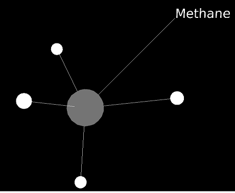
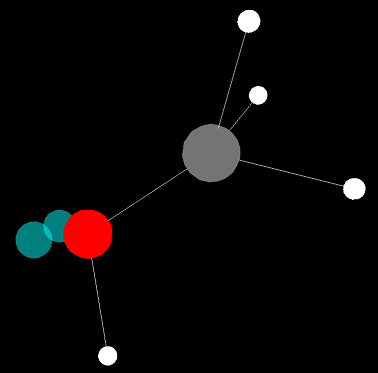
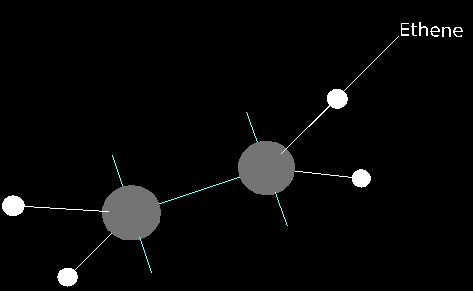

# Molecule Simulation #

This is a molecular simulation I created using Blender Game Engine around 2014. All the gaming logic uses Python.

The simulation allows building molecules by combining various elements such as carbon and hydrogen. As the molecules are created, they move around in a manner similar to some molecular models. In particular, VSEPR theory and the ball and spring model. 

The shapes are fairly accurate for small molecules, but larger molecules have different shapes than 
those observed in reality. 

Another feature of this simulation is automatic naming of simple molecules based on their component elements.   

## Screenshots ##

Note: This is a 3D simulation, even though the models appear 2D in these screenshots.

#### Methane ####

#### Methanol ####

#### Ethene ####

### Installation ###

Install blender from https://www.blender.org/ 

Open molecules.blend

Press P to play

### Controls ###
	
* Esc: Exit

* W,A,S,D: Movement

* Q/E: Move Down/Up

* R: reset

* 1,2,3,4,5,6: Switch between elements

* Left click: Fire element

* Right click: Fire carbon element
    
* Space: fire antimatter (destroys elements)

* T: fire laser
